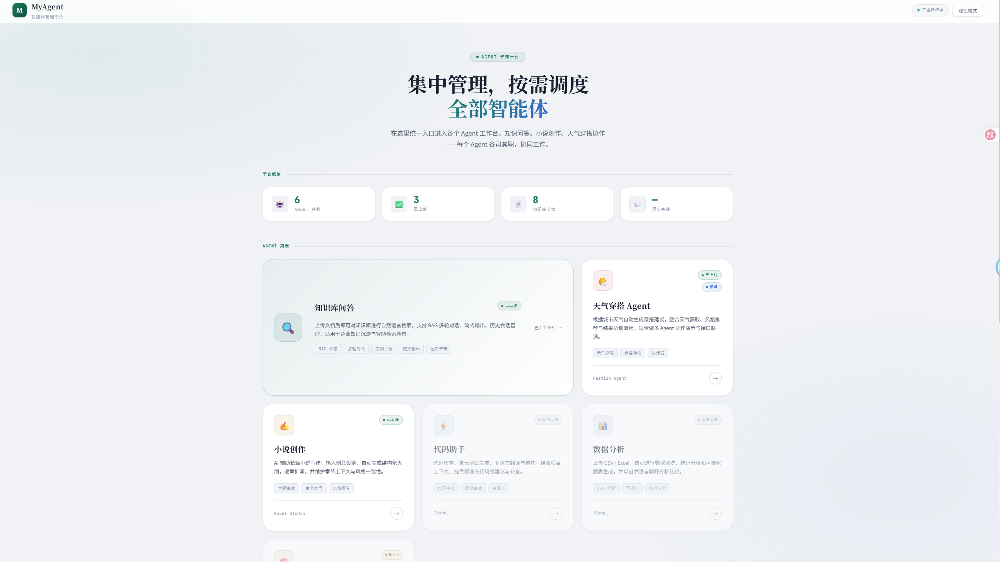
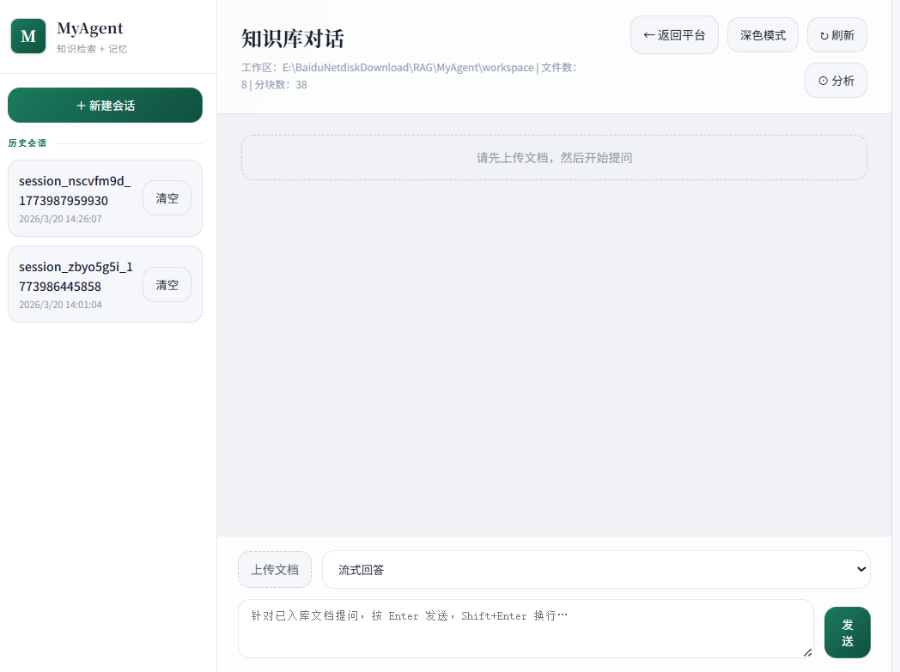
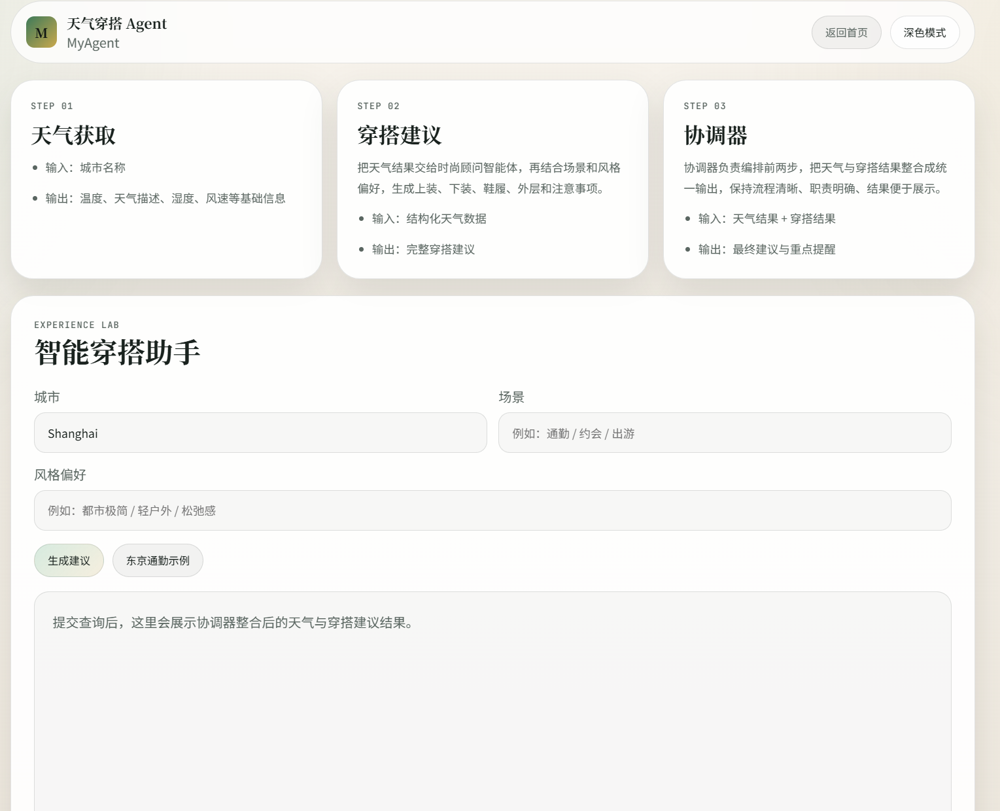
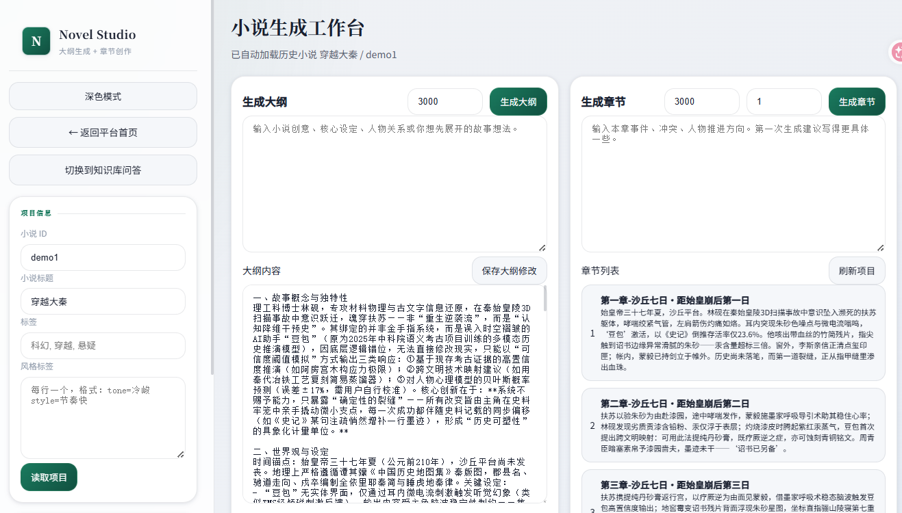

# MyAgent

MyAgent 是一个基于 Python + FastAPI 构建的多 Agent 应用项目，围绕“知识检索、内容生成、任务协同”三类核心场景，提供了可直接运行的 Web 页面、API 接口和基础 CLI 能力。项目把 RAG、对话记忆、天气驱动的穿搭推荐、小说创作等不同能力统一到同一套后端分层结构中，适合作为课程设计、毕业设计、多 Agent 系统实验和个人作品集项目的基础框架。

项目当前重点展示了 3 类典型 Agent 能力：

- 对话 Agent：支持文档上传、知识入库、RAG 检索、多轮问答与历史会话管理。
- 智能穿搭 Agent：串联天气获取、穿搭建议和协调器整合，展示多 Agent 协作流程。
- 小说创作 Agent：支持从创意输入到大纲生成、章节扩写、项目化管理的创作链路。

## 页面示意

### 首页



### 对话 Agent



### 智能穿搭 Agent



### 小说创作 Agent



## 项目特点

- 统一后端架构：采用 `router -> service -> agent / workflow / knowledge / storage` 分层，便于扩展新能力。
- RAG 知识问答：支持上传文档、切分、向量化、召回、重排和多轮对话。
- 多 Agent 协作演示：以天气穿搭场景展示“天气获取 -> 穿搭建议 -> 协调器整合”的流程化输出。
- 创作型 Agent：提供 Novel Studio 页面，支持小说项目读取、大纲生成、章节生成与保存。
- 前后端一体：`static/` 中包含多个可直接访问的演示页面，适合展示和答辩。
- 易于二次开发：能力模块按目录拆分，便于继续补充更多 agent、tool 或 workflow。

## 适用场景

- 多 Agent 系统原型开发
- RAG 检索问答实验
- FastAPI 全栈课程项目
- 智能写作 / 智能助手类产品原型
- 个人技术作品集展示

## 核心能力概览

### 1. 知识库对话

- 上传文档到工作区并完成入库
- 基于知识库做自然语言问答
- 支持流式输出与历史会话管理
- 支持工作区状态查看与基础诊断

### 2. 智能穿搭

- 输入城市、场景、风格偏好
- 获取天气快照
- 生成穿搭建议、推荐搭配与提醒
- 在结果页中展示三步协作流程

### 3. 小说创作

- 维护小说项目信息
- 基于创意生成结构化大纲
- 逐章生成章节内容
- 保存章节、摘要、下一章预测等内容

## 项目结构

当前项目采用“主实现集中在 `backend/app/`”的目录组织方式，Web 服务和 CLI 入口统一为 `backend.app.main`。

```text
MyAgent/
├─ backend/
│  └─ app/
│     ├─ main.py
│     ├─ core/
│     │  ├─ api.py
│     │  └─ llm.py
│     ├─ api/
│     │  ├─ routers/
│     │  │  ├─ aiops.py
│     │  │  ├─ chat.py
│     │  │  ├─ fashion.py
│     │  │  ├─ file.py
│     │  │  ├─ health.py
│     │  │  └─ novel.py
│     │  └─ schemas/
│     │     ├─ chat.py
│     │     ├─ common.py
│     │     ├─ fashion.py
│     │     ├─ file.py
│     │     └─ novel.py
│     ├─ services/
│     │  ├─ chat_service.py
│     │  ├─ fashion_service.py
│     │  ├─ file_service.py
│     │  ├─ novel_service.py
│     │  └─ runtime_service.py
│     ├─ agents/
│     │  ├─ base/
│     │  ├─ chat/
│     │  ├─ fashion/
│     │  ├─ novel/
│     │  ├─ rag/
│     │  ├─ travel/
│     │  └─ ops/
│     ├─ workflows/
│     │  ├─ chat_flow.py
│     │  ├─ fashion_flow.py
│     │  ├─ novel_flow.py
│     │  └─ rag_flow.py
│     ├─ knowledge/
│     │  ├─ base.py
│     │  ├─ chunker.py
│     │  ├─ compressor.py
│     │  ├─ documents.py
│     │  ├─ embedding.py
│     │  ├─ reranker.py
│     │  └─ summarizer.py
│     ├─ storage/
│     │  ├─ config.py
│     │  ├─ conversation.py
│     │  ├─ manager.py
│     │  ├─ memory_service.py
│     │  ├─ milvus.py
│     │  └─ storage.py
│     ├─ mcp/
│     ├─ observability/
│     └─ tools/
├─ docs/
├─ static/
├─ workspace/
├─ Dockerfile
├─ docker-compose.yml
└─ README.md
```

## 各目录职责

- `backend/app/main.py`：FastAPI 应用与 CLI 统一入口。
- `backend/app/api/routers`：接口层，只负责请求分发和响应组织。
- `backend/app/api/schemas`：请求与响应模型定义。
- `backend/app/services`：业务编排层，连接 router 与底层 agent / storage / knowledge。
- `backend/app/agents`：各类 Agent 的实现目录。
- `backend/app/workflows`：多步骤流程封装。
- `backend/app/knowledge`：文档处理、切分、向量化、召回、压缩、总结等知识能力。
- `backend/app/storage`：会话、配置、向量库和项目文件存储能力。
- `static/`：前端静态页面，包括首页、知识库对话、穿搭助手、小说创作等页面。
- `workspace/`：运行时生成的数据目录，如上传文档、知识库文件、小说项目文件等。
- `docs/`：README 配图和项目展示素材。

## 架构约束

- Router 不承载复杂业务逻辑。
- 业务逻辑优先进入 `services/`。
- Agent 能力统一放在 `agents/<name>/`。
- 知识处理模块统一放在 `knowledge/`。
- 存储与状态管理统一放在 `storage/`。
- 多步骤流程统一放在 `workflows/`。

## 快速开始

### 1. 安装依赖

```bash
pip install -r requirements.txt
```

### 2. 配置环境变量

项目根目录提供了 `.env` 和 `.env.example`。如果你需要启用在线天气、LLM 或向量能力，请根据实际情况补充对应的密钥和配置。

### 3. 启动服务

```bash
uvicorn backend.app.main:app --host 127.0.0.1 --port 8000 --reload
```

启动后可通过浏览器访问：

- `http://127.0.0.1:8000/`：平台首页
- `http://127.0.0.1:8000/agents/chat`：知识库对话
- `http://127.0.0.1:8000/agents/fashion`：智能穿搭
- `http://127.0.0.1:8000/agents/novel`：小说创作

## 常用 CLI

```bash
python -m backend.app.main ingest ./documents
python -m backend.app.main search "your query"
python -m backend.app.main chat "your question"
python -m backend.app.main stats
```

## 常用接口

### 健康检查

```text
GET /api/health
```

### Novel Agent

- `GET /api/novel/projects/{title}/{novel_id}`：读取小说项目元数据
- `POST /api/novel/outline/generate`：生成大纲
- `GET /api/novel/outline/{title}/{novel_id}/{note_id}`：读取大纲正文
- `PUT /api/novel/outline/update`：更新大纲
- `DELETE /api/novel/outline/{title}/{novel_id}/{note_id}`：删除大纲
- `POST /api/novel/chapter/generate`：生成一个或多个章节
- `GET /api/novel/chapter/{title}/{novel_id}/{note_id}`：读取章节
- `PUT /api/novel/chapter/update`：更新章节
- `DELETE /api/novel/chapter/{title}/{novel_id}/{note_id}`：删除章节

小说项目数据默认写入：

```text
workspace/novels/<title>-<novel_id>/
```

其中通常包含 `outline/`、`chapters/` 和 `project_data.json`。

### Fashion Agent

- `POST /api/fashion/advice`：生成穿搭建议
- `POST /api/fashion/advice_stream`：流式返回协调器整合后的穿搭建议

该能力参考了 `allen2000-FashionDailyDress` 的多 Agent 思路，并结合当前项目的 `agent / service / workflow / router` 分层进行了整合。

## Docker

- 项目已提供 `Dockerfile` 与 `docker-compose.yml`
- 健康检查接口为 `/api/health`

运行方式：

```bash
docker-compose up -d
```

## 后续可扩展方向

- 接入更多专业 Agent，例如代码助手、数据分析 Agent、AIOps Agent
- 引入更完整的权限控制与用户体系
- 补充测试、日志、可观测性和部署文档
- 增加更多 workflow 编排能力和工具调用能力

## 说明

README 已优先按照当前真实目录和页面能力整理。如果后续新增 Agent 页面或调整目录结构，建议同步更新本文档和 `docs/` 下的展示图片。
